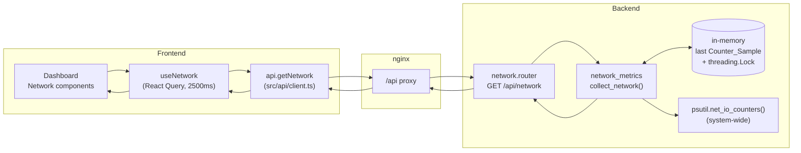

# Design Document

## Overview

This feature adds network throughput monitoring to the Home Server Command
Center: cumulative bytes sent/received since boot (from the host counters) plus
derived download/upload **rates** in bytes per second, system-wide (aggregate)
only. It is surfaced through a new
`GET /api/network` endpoint, a typed frontend client, a `useNetwork` polling
hook, and dashboard components.

### Scope note (ahead of roadmap)

The product roadmap scopes network monitoring to Phase 3, and `/api/network` is
reserved there in the API contract. The owner has deliberately chosen to build
network throughput now, out of phase. This design honours that decision by
**reusing the Phase 1 architecture without restructuring**: it adds exactly one
backend trio (router + service + models) plus one line of registration in
`main.py`, and one frontend client function + hook + components, matching the
`system` and `storage` resources. No speculative infrastructure for later
phases is introduced.

### The one thing that is different

Every existing resource (`system`, `storage`) is **stateless**: each request is
a fresh read. Network rates cannot be stateless. `psutil.net_io_counters()`
returns *cumulative* counters, not rates. A rate is only meaningful as the
change between two samples over elapsed time. Because Phase 1 has **no database
and no persisted state**, the previous sample must be held **in memory** between
requests. This makes the network service the first **stateful** service in the
codebase, and the design below is mostly about doing that safely and
fail-soft.

This design addresses Requirements 1-8 in
`.kiro/specs/network-throughput-metrics/requirements.md`.

## Architecture

The request flow mirrors the existing resources, with the stateful sampling step
added inside the service:



The frontend never talks to the host directly; it only calls `/api/network`
(Requirement 6.5). The router is thin and delegates all collection to the
service (Requirements 1.2, 1.5). The service is the only component that touches
`psutil` (structure/security steering).

### Stateful sampling design

The service keeps a module-level singleton holding the **last reading**:

- the aggregate cumulative counters (`bytes_sent`, `bytes_recv`),
- a monotonic timestamp (`time.monotonic()`) at which they were read.

Why `time.monotonic()` rather than wall-clock `time.time()`: monotonic time
never jumps backward on NTP corrections or clock changes, so `elapsed` is always
a sane positive delta under normal operation. Rate is:

```
rate = (current_bytes - previous_bytes) / (current_monotonic - previous_monotonic)
```

**Rate derivation, per direction:**

| Situation | Behaviour | Requirement |
|---|---|---|
| No previous sample (first request after boot) | both rates `null`; record current as the sample | 3.5, 3.6, 3.7 |
| `elapsed <= 0` | both rates `null`; record current as the sample | 3.6 |
| Counter went *down* in one direction (reset / wrap) | only that direction `null`; compute the other normally; record current | 3.7 |
| Normal case (`elapsed > 0`, counters non-decreasing) | `rate = delta / elapsed`, non-negative, rounded to 2 decimals; record current | 3.2, 3.3, 4.1 |
| A read raised an error | affected field(s) `null`; other fields still populated; still returns a valid response | 2.4, 5.1, 5.2 |

After computing (or deciding to null) the rates, the service **replaces** the
retained sample with the current reading and timestamp, so the next request
measures against this one (Requirement 3.4).

**Concurrency — the lock.** `uvicorn` can serve requests concurrently, and the
synchronous endpoint runs in a thread pool. Two overlapping requests would
otherwise race on the shared aggregate sample: interleaved read-compute-write
could produce torn reads (reading `bytes` from one request and `timestamp` from
another) or a lost update. The whole read-current → compute → store-sample
critical section is therefore guarded by a single module-level
`threading.Lock`. This is a deliberate, cheap choice: the critical section is a
couple of `psutil` reads and arithmetic (microseconds), there is only one shared
object, and correctness of the derived rates depends on the sample pair being
consistent. It is documented here so a future reader does not remove it as
"unnecessary".

**Failure isolation and sample integrity.** Each counter read is performed in its
own `try/except` so one failure nulls only its fields (Requirement 5.1, 5.2).
If the *entire* collection cannot proceed (e.g. `psutil` import/attribute
failure before any field is produced), `collect_network()` raises, the router
returns a 5xx, and critically the retained sample is **not** mutated — the
sample is only replaced after a reading is successfully obtained, so a failed
collection leaves no partial/cached state (Requirement 1.7).

## Components and Interfaces

### Backend (new trio + one registration line)

**`app/models/network.py`** — Pydantic models, the API contract source of truth.
`from __future__ import annotations`, nullable fields as `X | None`. Defines
`AggregateThroughput` and `NetworkResponse`.

**`app/services/network_metrics.py`** — stateful collection logic. Owns all
`psutil` access. Public function `collect_network() -> NetworkResponse`. Holds
the module-level singleton sample and `threading.Lock`. Internal helpers mirror
the fail-soft `_read_*` style of `system_metrics.py`:

- `_read_aggregate() -> tuple[int | None, int | None]` — `net_io_counters()`.
- `_derive_rate(prev_bytes, cur_bytes, elapsed) -> float | None` — the shared
  pure rate rule (null on no-prev/elapsed<=0/decrease, else rounded delta/elapsed).

A small dataclass (or plain tuple) `_Sample` holds
`(aggregate: tuple[int|None,int|None] | None, monotonic: float)`.
`collect_network()` acquires the lock, reads current counters + `time.monotonic()`,
derives rates against the retained sample, builds the `NetworkResponse`, replaces
the retained sample, releases the lock, and returns.

**`app/routers/network.py`** — thin router, same shape as `system.py`:

```python
router = APIRouter(prefix="/api", tags=["network"])

@router.get("/network", response_model=NetworkResponse)
def get_network() -> NetworkResponse:
    return collect_network()
```

No metric logic here (Requirement 1.5). On a total service failure the exception
propagates and FastAPI returns a 5xx (Requirement 1.7); partial failures are
already absorbed inside the service and return a 200 with nulls (Requirement
5.3).

**`app/main.py`** — the only core-wiring change:

```python
from app.routers import network, storage, system
...
app.include_router(network.router)
```

CORS `allow_methods` is already `["GET"]`, so no change there.

### Frontend

**`src/api/client.ts`** — add interfaces mirroring the Pydantic models and a
client function on the `api` object:

```ts
export const api = {
  getSystem: () => getJson<SystemResponse>("/api/system"),
  getStorage: () => getJson<StorageResponse>("/api/storage"),
  getNetwork: () => getJson<NetworkResponse>("/api/network"),
};
```

The existing `getJson` already throws on non-ok status (Requirement 6.3) and
casts the parsed JSON — a body that fails `res.json()` parsing rejects the
promise (Requirement 6.4).

**`src/hooks/useNetwork.ts`** — new hook, templated on `useSystem.ts`:

```ts
export function useNetwork() {
  return useQuery<NetworkResponse>({
    queryKey: ["network"],
    queryFn: api.getNetwork,
    refetchInterval: 2500,
    refetchIntervalInBackground: true,
    placeholderData: (prev) => prev,
  });
}
```

`refetchInterval: 2500` satisfies the 2000-3000ms window (Requirement 7.2);
`refetchIntervalInBackground` keeps polling in a background tab;
`placeholderData: (prev) => prev` keeps the last successful data during a
refetch and on error (Requirements 7.3, 7.5). React Query's default `isLoading`
+ `undefined` data before first success covers Requirement 7.4.

**`src/lib/format.ts`** — add `formatRate(bytesPerSec: number): string` reusing
the `formatBytes` 1024-scaling approach, appending `/s` (e.g. `"1.2 MB/s"`).
`formatBytes` already exists and is reused for cumulative totals. `formatRate`
assumes a non-null number; the component guards null before calling it.

**`src/pages/Dashboard.tsx`** — add network `MetricCard`(s) using the existing
`MetricCard` / `UsageBar` / `StatusBadge` / `Unavailable` pattern. The card
shows aggregate **download** and **upload** rate and cumulative **sent** /
**recv**. Each value guards null and renders `<Unavailable />` in its place
while siblings still render (Requirement 8.3). The network section is rendered
even when `network.isError` is true (it is not unmounted); `placeholderData`
means the last values stay on screen during errors (Requirement 8.4), and a
subsequent success replaces them within one poll (Requirement 8.5).

## Data Models

### Pydantic (backend) — `app/models/network.py`

```python
from __future__ import annotations

from pydantic import BaseModel


class AggregateThroughput(BaseModel):
    bytes_sent: int | None          # cumulative, null if unreadable
    bytes_recv: int | None
    download_rate_bps: float | None  # bytes/sec; null until a baseline exists
    upload_rate_bps: float | None


class NetworkResponse(BaseModel):
    aggregate: AggregateThroughput
```

Naming note: "download" maps to received bytes, "upload" maps to sent bytes.

### TypeScript (frontend) — mirrored in `src/api/client.ts`

```ts
export interface AggregateThroughput {
  bytes_sent: number | null;
  bytes_recv: number | null;
  download_rate_bps: number | null;
  upload_rate_bps: number | null;
}

export interface NetworkResponse {
  aggregate: AggregateThroughput;
}
```

### Example `GET /api/network` response

Normal case (baseline established, counters readable), following api-contract
conventions (snake_case keys, bytes, bytes-per-second rates, nullable fields):

```json
{
  "aggregate": {
    "bytes_sent": 10485760000,
    "bytes_recv": 52428800000,
    "download_rate_bps": 1258291.20,
    "upload_rate_bps": 262144.00
  }
}
```

First request after boot (no baseline yet) — rates null, counters present:

```json
{
  "aggregate": {
    "bytes_sent": 10485760000,
    "bytes_recv": 52428800000,
    "download_rate_bps": null,
    "upload_rate_bps": null
  }
}
```

Counters entirely unavailable (e.g. a host where the read fails) — still a valid
200:

```json
{
  "aggregate": {
    "bytes_sent": null,
    "bytes_recv": null,
    "download_rate_bps": null,
    "upload_rate_bps": null
  }
}
```

## Correctness Properties

*A property is a characteristic or behavior that should hold true across all
valid executions of a system — essentially, a formal statement about what the
system should do. Properties serve as the bridge between human-readable
specifications and machine-verifiable correctness guarantees.*

The network rate logic is a pure, input-varying computation over sampled counter
readings, so it is well suited to property-based testing. The service is tested
by **injecting** consecutive readings and monotonic timestamps (rather than
calling the real `psutil`), which lets a property generate thousands of sample
pairs cheaply. UI rendering, hook wiring, and routing facts are covered by
example/integration tests instead (see Testing Strategy).

### Property 1: Rate equals delta over elapsed, non-negative, rounded

*For any* previous and current counter reading in one direction where a previous
sample exists, `elapsed > 0`, and the current counter is greater than or equal
to the previous counter, the derived rate equals `round((current - previous) /
elapsed, 2)` and is `>= 0`.

**Validates: Requirements 3.2, 3.3, 4.1**

### Property 2: Rate is null exactly under the defined conditions

*For any* direction (download or upload), the derived rate is `null` **if and
only if** at least one of: there is no previous sample, `elapsed <= 0`, the
current counter is lower than the previous (reset/wrap), or the current read for
that direction failed — otherwise the rate is a non-null number. Nulling one
direction never nulls the other when the other's conditions are met.

**Validates: Requirements 3.5, 3.6, 3.7, 4.4, 1.4, 2.4**

### Property 3: Cumulative bytes are non-negative and passed through unchanged

*For any* readable counter reading, every cumulative byte value in the response
equals the value from the source reading unmodified and is an integer in the
range `[0, 2^64)`; when a cumulative read fails, that value is `null`.

**Validates: Requirements 1.3, 2.2, 2.3**

### Property 4: The retained sample after a request equals the current reading

*For any* request that obtains a reading, after the response is produced the
retained in-memory sample's counters and monotonic timestamp equal the current
reading's counters and timestamp (so the next request measures against this one).

**Validates: Requirements 3.1, 3.4**

### Property 5: A failed collection does not mutate the retained sample

*For any* retained sample state, if obtaining the current reading fails such that
`collect_network()` cannot produce a response, the retained sample is left
exactly as it was before the request (no partial or cached update), and the
caller observes an error rather than a 200.

**Validates: Requirements 1.7**

### Property 6: Fail-soft field independence

*For any* subset of counter reads forced to fail, every field whose read did not
fail is still populated in a valid `NetworkResponse`, and only the fields whose
reads failed are `null`. When every read fails, the response is still a valid
`NetworkResponse` with aggregate fields `null`.

**Validates: Requirements 5.1, 5.2, 5.3**

### Property 7: Display formatting scales into the readable band

*For any* positive bytes-per-second value, `formatRate` produces a string whose
numeric part is `>= 1` and `< 1000` with at most 2 decimal places plus a
per-second unit label (except where the value floors at the smallest unit); and
*for any* positive byte value, `formatBytes` produces a correspondingly scaled
value with a unit label. (Zero and non-finite inputs are handled by the existing
`formatBytes` floor.)

**Validates: Requirements 8.1, 8.2**

## Error Handling

**Backend — fail-soft per field (the default).** Each counter read is performed
in its own `try/except` returning `None` on failure. A single unreadable field
becomes `null` while the rest of the response is built, and the endpoint returns
**200** with a valid body. This matches `system_metrics.py` and covers macOS
dev (Requirements 2.4, 5.1-5.3).

**Backend — total failure (5xx).** If collection cannot produce a reading at all,
`collect_network()` raises and FastAPI returns a server error. The router adds no
try/except that would swallow this into a partial 200, and the retained sample is
only written after a successful reading, so no partial/cached state persists
(Requirement 1.7).

**Rate-specific edge cases** (handled, not errors): first sample → null; `elapsed
<= 0` → null; counter decrease/reset → that direction null (Requirements 3.5-3.7,
4.3, 4.4).

**Frontend.** `getJson` throws on non-ok status and on unparseable JSON
(Requirements 6.3, 6.4). `useNetwork` surfaces `isError` while
`placeholderData: (prev) => prev` retains the last good data and keeps polling
(Requirement 7.5). The Dashboard keeps the network section mounted on error,
renders `<Unavailable />` for null values, and lets the next successful
poll replace them (Requirements 8.3-8.5). Null individual values render
`<Unavailable />` without affecting sibling values (Requirement 8.3).

## Testing Strategy

Dual approach: **property-based tests** for the pure, input-varying rate and
formatting logic; **example/integration tests** for routing, wiring, typing, and
UI rendering.

### Property-based testing

- **Library:** `hypothesis` for Python (backend service), `fast-check` for
  TypeScript (frontend formatting). Do not hand-roll generators/shrinking.
- **Iterations:** each property test runs a minimum of **100** iterations.
- **Tagging:** each property test carries a comment referencing its design
  property, format: `Feature: network-throughput-metrics, Property {n}: {text}`.
- **Determinism via injection:** the service's rate logic is exercised by
  injecting counter readings and monotonic timestamps (e.g. via a seam that
  feeds `_read_aggregate` and `time.monotonic`), so properties generate sample
  *pairs/sequences* without real network I/O. Properties 1-6 map to backend
  tests; Property 7 maps to `fast-check` tests over `formatRate` and
  `formatBytes`.

### Backend unit/integration tests (`pytest`)

- Rate edge cases as focused examples alongside the properties: first-sample →
  null; counter reset in one direction → that direction null, other computed;
  `elapsed <= 0` → null.
- **Router** via FastAPI `TestClient`: `GET /api/network` returns 200 with the
  expected key set (snake_case matching the model) (Requirements 1.1, 1.6, 1.2);
  all-reads-fail scenario returns 200 with all-null aggregate (Requirement 5.3);
  a forced total-collection failure returns a 5xx and does not emit a partial
  200 (Requirement 1.7).
- **Delegation**: patch `collect_network` to confirm the router passes its result
  through unchanged and holds no metric logic (Requirements 1.2, 1.5).

### Frontend tests (`vitest`)

The existing harness at `frontend/src/test/` (jsdom + React Testing Library +
jest-dom, `setup.ts`) is reused.

- **`formatRate` / `formatBytes`**: `fast-check` property tests (Property 7) plus
  example cases (`0`, small values, GB/s scale, `/s` suffix).
- **`useNetwork`**: render with a `QueryClientProvider` and a mocked `api`;
  assert it calls `api.getNetwork`, exposes loading then data, retains
  placeholder data on refetch, and surfaces an error state while retaining the
  last data (Requirements 7.1-7.5), using fake timers to advance the interval.
- **`client.getNetwork`**: mock `fetch` to assert it requests `/api/network`,
  returns parsed data, and rejects on non-ok status and on unparseable JSON
  (Requirements 6.1, 6.3, 6.4).
- **Dashboard network section**: render with non-null values (formatted output
  shown), with one null value (`Unavailable` shown, siblings intact —
  Requirement 8.3), and in an error state (section stays mounted, last values
  retained — Requirement 8.4); transition error → success replaces the indicator
  (Requirement 8.5).

### Not covered by PBT (deliberate)

Routing existence, snake_case key shape, React Query option wiring, TypeScript
nullability, and the architectural "router/client has no system access" rules are
facts/config, not input-varying logic — verified by the example/integration and
type checks above rather than property tests.
