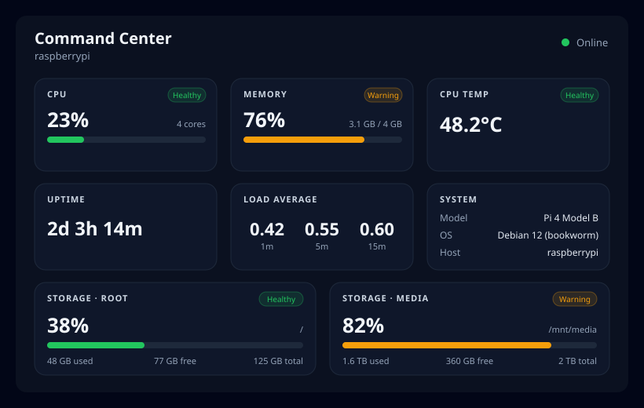

# Home Server Command Center

A simple web dashboard for your Raspberry Pi. Open it on your phone and see, at a
glance, how your Pi is doing: how busy the processor is, how much memory and disk
are in use, how hot it's running, and how long it's been on.

It runs entirely on your own Pi. Nothing is sent to the cloud, and there's no
account to create.

> **What this version does (Phase 1):** live system and storage monitoring only.
> Things like Jellyfin, qBittorrent, and start/stop buttons come in later
> versions.



---

## What you'll need

- A Raspberry Pi (a Pi 4 with Debian / Raspberry Pi OS is the main target) that
  you can reach on your home network.
- **Docker** and the **Docker Compose** plugin installed on the Pi. If you don't
  have them yet, the one-line install is:
  ```bash
  curl -fsSL https://get.docker.com | sh
  ```
  Then let your user run Docker without `sudo` (log out and back in afterward):
  ```bash
  sudo usermod -aG docker $USER
  ```
- A phone or computer on the **same Wi-Fi/network** as the Pi.

You do **not** need to know how to code, and you do **not** need to download this
project's source code to run it. The app ships as ready-made Docker images.

---

## The fastest way to run it (recommended)

This pulls prebuilt images and starts the dashboard. No cloning, no building.

**1. On the Pi, make a folder for the app and go into it:**
```bash
mkdir -p ~/command-center && cd ~/command-center
```

**2. Download the two small config files:**
```bash
curl -O https://raw.githubusercontent.com/danyjoy/rPi-home-server-dashboard/main/docker-compose.prod.yml
curl -o .env https://raw.githubusercontent.com/danyjoy/rPi-home-server-dashboard/main/.env.example
```
- `docker-compose.prod.yml` tells Docker which images to run.
- `.env` is a plain-text settings file you can edit (see
  [Settings](#settings-the-env-file) below). The defaults are fine to start.

**3. Start it:**
```bash
docker compose -f docker-compose.prod.yml up -d
```
The first time, Docker downloads the images (a minute or two). `-d` means "run in
the background."

**4. Open the dashboard.** On your phone or computer, go to:
```
http://<your-pi-ip>:9180
```
Replace `<your-pi-ip>` with your Pi's address, e.g. `http://192.168.1.50:9180`.
Not sure of the IP? On the Pi run `hostname -I` and use the first number.

That's it. The page updates by itself every couple of seconds.

### Everyday commands

```bash
# See if it's running
docker compose -f docker-compose.prod.yml ps

# Stop it (your settings are kept)
docker compose -f docker-compose.prod.yml down

# Start it again later
docker compose -f docker-compose.prod.yml up -d
```

---

## Updating to a new version

New images are published automatically whenever the project changes. Getting
them on your Pi is two commands: **pull** the new image, then **restart** the
app. Your `.env` settings are kept.

### If you're on `latest` (the default)

```bash
cd ~/command-center     # the folder you set up earlier
docker compose -f docker-compose.prod.yml pull   # download the newest images
docker compose -f docker-compose.prod.yml up -d  # restart using them
```

That's all. `pull` fetches whatever is newest; `up -d` swaps the running
containers for the updated ones. If nothing new was published, `pull` simply
reports the images are already up to date and nothing changes.

### Moving to a specific released version

Each release also has a fixed version tag (for example `v1.0.0`), so you can run
an exact version instead of always tracking `latest`. Edit `.env` and set:

```
TAG=v1.0.0
```

Then pull and restart:

```bash
docker compose -f docker-compose.prod.yml pull
docker compose -f docker-compose.prod.yml up -d
```

Browse the available versions on the
[Releases page](https://github.com/danyjoy/rPi-home-server-dashboard/releases).
To go back to always-newest, set `TAG=latest` and pull again.

### Free up old images (optional)

After several updates, old image layers pile up. Reclaim the space with:

```bash
docker image prune -f
```

### Did it actually update?

```bash
# Show the image each container is currently running
docker compose -f docker-compose.prod.yml images
```

Compare the tag/ID there with what you expected. You can also just reload the
dashboard in your browser.

---

## Settings (the `.env` file)

Open `.env` in a text editor (`nano .env`) to change any of these. After editing,
re-run the `up -d` command to apply.

| Setting | What it does | Default |
|---|---|---|
| `FRONTEND_PORT` | The port you open in the browser | `9180` |
| `STORAGE_MOUNTS` | Which disks to show (see below) | `root:/` |
| `TAG` | Which version to run (`latest` or e.g. `v1.0.0`) | `latest` |
| `OWNER` | GitHub account the images come from | `danyjoy` |

### Showing a media drive

By default the dashboard shows your main disk (`/`). If you have an extra drive
(for movies, downloads, etc.) mounted at, say, `/mnt/media`, list it like this in
`.env`:
```
STORAGE_MOUNTS=root:/,media:/mnt/media
```
The format is `label:path`, separated by commas. Each entry becomes its own card.

### Pinning a version

`latest` always gives you the newest build. If you'd rather lock to a specific
release so nothing changes unexpectedly, set:
```
TAG=v1.0.0
```

---

## Is it working? Quick checks

- The page at `http://<your-pi-ip>:9180` shows cards for CPU, Memory, Temp, etc.
- Cards are color-coded: **green** = healthy, **amber** = getting high,
  **red** = critical.
- Some cards may say **"unavailable"** — that's normal if your hardware doesn't
  report that value (for example, CPU temperature isn't available on every
  machine). It is not an error.

---

## Troubleshooting

**The page won't load.**
- Double-check the IP (`hostname -I` on the Pi) and that you included `:9180`.
- Make sure your phone is on the same network as the Pi.
- Check the app is running: `docker compose -f docker-compose.prod.yml ps`.

**"Can't reach the backend" banner on the page.**
- Give it a few seconds after starting. If it persists, view the logs:
  ```bash
  docker compose -f docker-compose.prod.yml logs
  ```

**Port 9180 is already in use.**
- Change `FRONTEND_PORT` in `.env` to something else (e.g. `9280`) and run
  `up -d` again. Then open the new port in your browser.

**"denied" or login error when pulling images.**
- The images need to be public, or you need to log in. If they're private, run:
  ```bash
  echo <YOUR_GITHUB_TOKEN> | docker login ghcr.io -u danyjoy --password-stdin
  ```
  (A token with `read:packages` permission. Replace with your own username if you
  forked this project.)

---

## How it's put together (optional background)

```
Your phone ──▶ Dashboard (web page) ──▶ Backend (reads the Pi) ──▶ The Pi's stats
   browser         served by nginx          FastAPI service
                   on port 9180             (not exposed directly)
```

- The **frontend** is the web page you see, built with React and served by nginx.
- The **backend** is a small service (Python/FastAPI) that reads the Pi's stats
  and hands them to the page. It's the only part allowed to look at the system,
  and it only reads — it never changes anything in this version.
- Both run as regular (non-root) users, with no special privileges, and the
  backend's view of the system is **read-only**.

---

## For developers

Want to change the code or run it from source? See
[`docs/DEVELOPMENT.md`](docs/DEVELOPMENT.md) for building locally, running without
Docker, and how the project is organized. Design notes live in `.kiro/specs/` and
project conventions in `.kiro/steering/`.

---

## Roadmap

Phase 1 (this version) is system monitoring. Planned next: service monitoring,
Jellyfin and qBittorrent integration, start/stop controls, charts, alerts, and
secure remote access.
